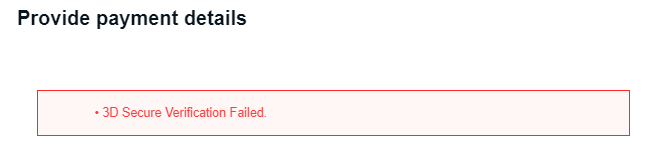

  

# **OptiFine Support FAQ**

## **Table of Contents:**
- [How to contribute](./contribute.md)
- [Common Cape Issues](#common-cape-issues)
- [Other](#other)

## **Common Cape Issues:**

### **A user's cape was stolen**
There is not really anything we can do here. But tell the user that they can reset the password for Minecraft, Email, and optifine.

### **Cape Not Showing Ingame**
- Check Both Settings (Skin Customization > Cape: ON & Video Settings > Details > Show Capes: ON)
- Check that the cape is assigned to their Account
- Clear Browser Cookies
- Check if Anti-Virus is blocking OptiFine
- Check if ISP is blocking OptiFine ([More Information here](#how-to-check-if-an-isp-is-blocking-optifine))
- Check that they can connect to the cape server, send the link in a fashion that Discord does not provide a preview image, such as "`http://s.optifine.net/capes/sp614x.png`". If they can't, proceed to [Cape Server Blocked](#cape-server-blocked).

### **Cape Server Blocked**
There are multiple reasons why a cape server is blocked, the popular reason is that the user installed a app that would block the OptiFine's servers so that they can getcustom capes.

In short, have the user open "`C:\Windows\System32\drivers\etc\hosts`", if a line contains "`s.optifine.net`" is there, then we need to delete it.

- Open Notepad with Administrator (Search "Notepad" in your Windows Search Bar, right click on it and press Run as Administrator. Accept the prompt that comes up.
- Press File -> Open
- In the bottom right corner of the file window, change "Text Documents (\*.txt)" to "All Files (\*.*)"
- Navigate to "`C:\Windows\System32\drivers\etc`"
- Double click on hosts
- Delete the entire line that contains "`s.optifine.net`"
- Press Control + S to save.
- Close Notepad and restart your computer.

Video Instructions: https://cdn.discordapp.com/attachments/423433009568546827/840255001874923550/UNuNojRux6.mp4

### **Banner Cape Doesn't Work**
Make sure that the user isn't using more than 8 layers on the banner.

### **Why can't users use the Mojang patter?**
This is a common question. The answer is: To prevent people impersonating Mojang employees.

### **Modern & Mojang Patterns**
Piglin and globe patterns are not supported yet because of needcoolshoes.com needing permission from mojang.
Mojang Pattern is not allowed because of Copyright + Impersonation

## **Common File Issues:**

### **OptiFine opening with something *other* than Java**
Download Java (https://java.com) or AdoptOpenJDK (https://adoptopenjdk.net/)
If the user is trying to use Minecraft 1.17+ they would need to install [OpenJDK 16](https://adoptium.net/?variant=openjdk16&jvmVariant=hotspot)
- If there is still an error Download JarFix (https://johann.loefflmann.net/en/software/jarfix/index.html)

### **Linux**
Ubuntu/Ubuntu Based: Have them go to the properties of the .jar and enable "Allow Executing"
Arch/Arch Based: `chmod +x optifine-jar-file.jar`

### **OptiFine installer error (Access Denied)**
If there is a file permission error try deleting the OptiFine Version from the libraries folder "`C:\Users\<user>\AppData\Roaming\minecraft\libraries\optifine\OptiFine\<version>`"

### **How to check if an ISP is blocking OptiFine**
If you believe that a Internet Provider is blocking the OptiFine cape servers, you can check by doing the following:
- Go on a mobile device
- Open a browser and go to `http://s.optifine.net/capes/sp614x.png`
If the user cannot see the cape design on there also, chances are, their ISP is blocking it.

Note: **Personally, when I see a user with this issue I tell them to restart their router and that usually fixes it.**

## **Other:**

### **PvP Clients**
We do not officially provide support for them. If you want to help out, that's fine. But it's recommended that you ask them to go to a stand-alone version of OptiFine andif the issue continues, you can help them. If not, its most likely the pvp client causing the issue.

### **Refunds**
If you have anyone that is wanting to refund their capes or has anything related to PaymentWall, dont redirect them to sp614x.
Instead redirect them to PaymentWall's support (https://www.paymentwall.com/en/contacts)

### Note: **PayPal or Bank Chargeback can block you.**

### **Change Email**
If the user donated within 30 days, they should probably refund the donation and if they choose, donate again. Otherwise it's a lost cause. 
You can see if they can create the email they donated with.
If it's a misspelled email provider (i.e. @gmial.com, @gmail.cm) get them to email our support email ([optifinex@gmail.com](mailto:optifinex@gmail.com)).
    
### **Data Deletion Requests/GDPR Requests**
If the request is not via email, tell them to send an email from the email that is attached to the account they'd like to remove.
First, check that the user has an actual account by searching the email in the Database. If one comes up, proceed. If one doesn't, tell the user. We can ONLY processrequests sent in from the actual email.
Then, send a confirmation email that will be found as a canned response under "Data Deletion Confirmation" and replacing the filler content with their email.
Once they agree, DM sp614x with the email and a link to the ticket.

### **Minecraft/OptiFine running on iGPU not dGPU**
Open dGPU Control Panel (AMD Adrenaline or NVidia Control Panel (NOT GeForce Experience))
**AMD Adrenaline**:
- Go To "Gaming" Tab
- Add a Game
- Locate javaw.exe (Normally in `C:\Program Files (x86)\Minecraft Launcher\runtime\jre-x64\bin` FOR STOCK MINECRAFT)

**NVidia Control Panel (IF USING VANILLA LAUNCHER IT MAYBE AUTO ADDED BY GeForce Experience)**:
- Manage 3D Settings
- Program Settings
- Add -> Browse
- Locate javaw.exe (Normally in `C:\Program Files (x86)\Minecraft Launcher\runtime\jre-x64\bin` FOR STOCK MINECRAFT)
- Select NVidia Processor in drop down -> Click Apply
    
Note: **IF they have Minecraft running under a different version of java, it will be located in `C:\Program Files\AdoptOpenJDK\<java version>\bin` or `C:\ProgramFiles\Java\<java version>\bin` and must be javaw.exe**

### White lines/Lines around blocks
- **1.)** Close Minecraft and any other games, open Nvidia Control Panel (right click on the desktop then click Nvidia Control Panel)
- **2.)** Click `Adjust image settings with preview`
- **3.)** Click `Let the 3D application decide` then click `Apply` in the bottom right 

The lines should no longer show up around blocks.

## **Mod Errors:**
This area should explain popular OptiFine erros, both website related or mod related.

### **OpenGL Errors**
What are OpenGL errors? They relate to your Graphics card drivers. Usually, outdated or corrupted drivers will produce a certain error, or cause crashes. What do they mean? Well OpenGL uses these errors for multiple things. People report it this issue with a lot of unrelated problems. So it's kind of hard to say exactly what they mean, I will try to explain what is the most common reason.

| Errors | Description | Reason |
| --- | ----------- | ----------- |
| **0** | No Error | You know what this is. |
| **1280** | Invalid enum | Usually this is caused by broken or outdated drivers. Sometimes it can be caused by broken shaders / resource packs. |
| **1281** | Invalid value | From what I have seen, this is common with broken shaders or textures. This can generally be ignored unless there is something visibly broken.  |
| **1282** | Invalid operation | Commonly this error is caused by a broken shader. Or just like the others, outdated / broken drivers. |
| **1283** | Stack overflow | I couldn't find a common issue. |
| **1284** | Stack underflow | Seems to be something related to broken shaders. I couldn't find too many issues. |
| **1285** | Out of memory | I couldn't find a common issue. This most likely is caused by the GPU running out of memory. |
| **1286** | Invalid framebuffer operation | I couldn't find a common issue. This most likely is caused by outdated or broken drivers. |

## **Launcher Errors:**

| Errors | Description | Fix | Example Image |
| --- | ----------- | ----------- | ----------- |
| **Access Denied:** | Not Fully known why this error happens. | Go to the file location `C:\Users\<your username here>\AppData\Roaming\.minecraft\libraries\optifine\OptiFine` And delete the folder named the version you are trying to install, then restart your pc. |  |
| **Unable to install java. There are errors in the following switches: \*** | Java File associations broke. | Download [Jarfix](https://johann.loefflmann.net/jarfix). This usually fixes the error. |  |
| **Unable to press the install button (Grayed out):** | This usually means that the user has a space or an invalid character in their Users directory. | Change their file location, or change their computer username. |  |

## **Website Errors:**

| Errors | Description | Fix | Example Image |
| --- | ----------- | ----------- | ----------- |
| **Inernal Server Error (Editing Cape) \|\| Cape Not Found for: <user> (When they have a cape)** | It is not fully known why this error happens, we just know that sometimes it does. | We usually directly message sp614x to fix the cape. He has to manually edit something in the database. |  |
| **3D Secure Verification Failed.** | It is not fully known why this error happens, other than Paymentwall suspects fraud. This is not caused by OptiFine or can be fixed by OptiFine. **When this error happens, you will not be charged.** | Email [support@paymentwall.com](mailto:support@paymentwall.com) and get support there. |  |